<div align="center">


[](https://github.com/Starlightmii/StarScale/releases)
[](LICENSE)
[](index.html)
[](#why-it-works-from-file)

**one html file · two engines · zero install**

*point it at a blurry photo → watch the stars do the rest* ✦

</div>

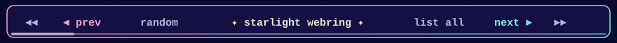


## ✦ what is this

**StarScale** is an AI & GPU image upscaler that lives in a *single `.html` file*.
No install. No server. No build step. Open it in Chrome — desktop **or** Android —
and upscale photos with Real-ESRGAN-class neural models or instant WebGL2 kernels.

> ✧ the whole app — UI, GLSL shaders, the AI worker — is one file you can email to someone ✧

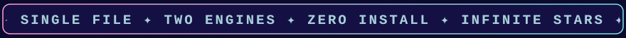


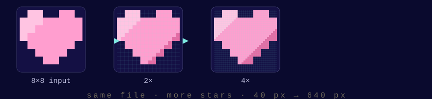

## ⚡ quick start

```bash
# desktop — that's it:
xdg-open index.html

# android — open index.html with Chrome (Files app → open with),
# or serve it:
python3 -m http.server 8000   # → http://localhost:8000
```

Chrome menu → **Add to Home screen** = instant PWA. ✦

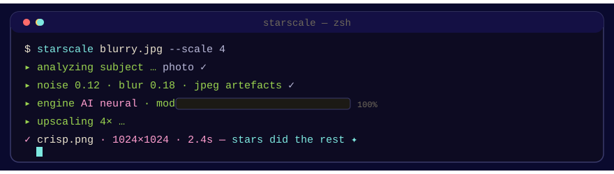

## 🛰 two engines, one file

| | ☆ GPU RESAMPLE | ★ AI NEURAL |
|---|---|---|
| **tech** | WebGL2, separable kernels | ONNX Runtime Web in a Blob worker |
| **kernels** | Lanczos3 · Catmull-Rom · B-spline · nearest | 7 models + custom `.onnx` |
| **detail pass** | edge-aware sharpening | tiled super-resolution |
| **speed** | ⚡ instant, any size | 🕐 tiled, minutes for big images |
| **download** | nothing. ever. | model (1.7–29 MB) once, then IndexedDB cache |

**the model shelf** — fetched from Hugging Face, cached forever after:

```
realesr-x4v3      4×   general        ★ the sensible default
purephoto-span    4×   photos+faces   tiny & fast
clearreality      4×   general        smallest general model
rybu              4×   anime/lineart  illustrations go brrr
span-2x           2×   general        when only 2× is wanted
realplksr-hq      4×   photos         best photo quality (heavy)
dejpeg            1×   pre-pass       strips jpeg artefacts first
+ custom .onnx    any  any            bring your own weights
```

✦ the app *analyzes every import* — subject, noise, blur, jpeg artefacts, exposure —
and recommends an engine/model. override it whenever you want.

## 🎛 the workspace

- **import analysis + one-tap recommendations** — rule-based, transparent
- **presets** — quality/speed dials without the dials
- **output & memory estimator** — know before you commit
- **color grading** — GLSL, neutral by default, nothing touches your pixels uninvited
- **crop** — frame it before you scale it
- **face detection + recovery** — UltraFace ONNX for portrait rescue
- **compare modes** — split ✦ side-by-side ✦ difference ✦ flicker
- **batch queue** — drag-reorder, per-item engine/model override
- **export** — PNG / JPEG (EXIF preserved) / WebP / all-at-once ZIP
- **share** — native Android share sheet
- **command palette** — `Ctrl/Cmd-K`, mouse optional
- **two themes** — dark *pro* studio / light *paper* print-shop


## 📡 transmission: equalizer + counter

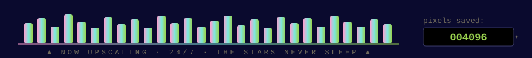

## ✨ why it works from `file://`

Everybody says a `file://` page can't run Web Workers, so single-file AI demos
freeze the main thread. Half true — measured, not assumed:

```text
new Worker("https://cdn…/ort.js")     → SecurityError  ✗ BLOCKED
importScripts("https://cdn…/ort.js")  → NetworkError   ✗ BLOCKED
fetch("https://cdn…/ort.js")          → HTTP 200       ✓ WORKS
```

So StarScale fetches the ONNX Runtime source over HTTP (allowed), builds a
Blob worker from an inlined worker string, and injects the runtime via
`importScripts(blob)`. No server. No bundler. Verified in Chrome 151; Firefox works too.


## 🎺 retro annex

<div align="center">

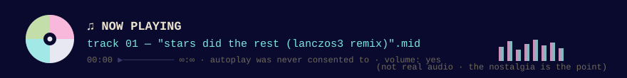

https://github.com/user-attachments/assets/644b312b-8816-48ee-b3a8-b827cb557572

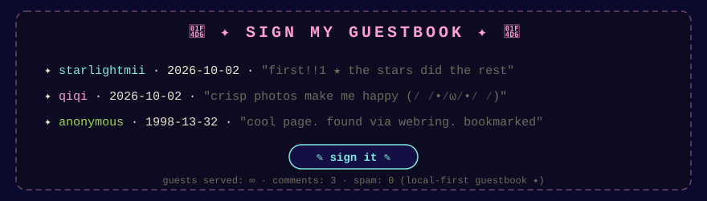

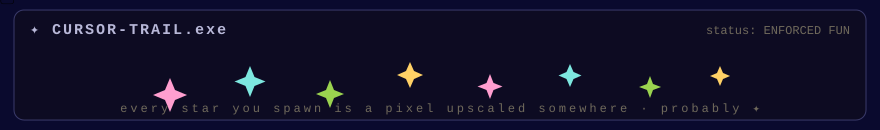

</div>

## 🔒 privacy

Images **never leave your device** — inference is local (WebGL / WebGPU / WASM).
Only network traffic, all cached after first use:

```text
✦ Google Fonts            → theme faces (degrades offline)
✦ jsDelivr / unpkg        → ONNX Runtime script
✦ Hugging Face            → model weights
```

Storage keys are namespaced `starscale.*` in IndexedDB/localStorage.

## 🧬 sources & credits

| component | source |
|---|---|
| ONNX Runtime Web 1.20.0 | [microsoft/onnxruntime](https://github.com/microsoft/onnxruntime) · [jsDelivr](https://cdn.jsdelivr.net/npm/onnxruntime-web@1.20.0/dist/) / [unpkg](https://unpkg.com/onnxruntime-web@1.20.0/dist/) |
| Real-ESRGAN v3 (onnx) | [CoderViking/realesr-general-x4v3-onnx](https://huggingface.co/CoderViking/realesr-general-x4v3-onnx) |
| SPAN · ClearReality · Rybu · DeJPEG · RealPLKSR (onnx) | [huggingworld/onnx-image-models](https://huggingface.co/huggingworld/onnx-image-models) |
| UltraFace RFB-320 (face detect) | [onnxmodelzoo/version-RFB-320](https://huggingface.co/onnxmodelzoo/version-RFB-320) |
| Real-ESRGAN research | [xinntao/Real-ESRGAN](https://github.com/xinntao/Real-ESRGAN) — Li et al., 2021 |
| SPAN architecture | [chenghao-zhuo/span](https://github.com/chenghao-zhuo/span) |
| IM Fell English · Cardo · Special Elite | [Google Fonts](https://fonts.google.com/) |

model weights keep their respective licenses — check each HF page before commercial use.

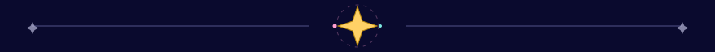

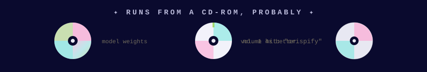


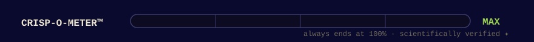

## 🗂 repo layout

```
index.html      the entire app — UI, GLSL, worker (~4.6k lines)
assets/         24 animated SVGs — the README is a Y2K screensaver now
README.md       you are here ✦
LICENSE         MIT
```

<div align="center">




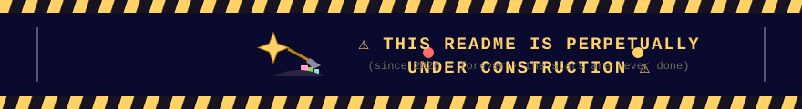


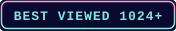 \<br>

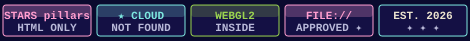

⭐ **star the repo if it saved your pixels** ⭐

</div>
